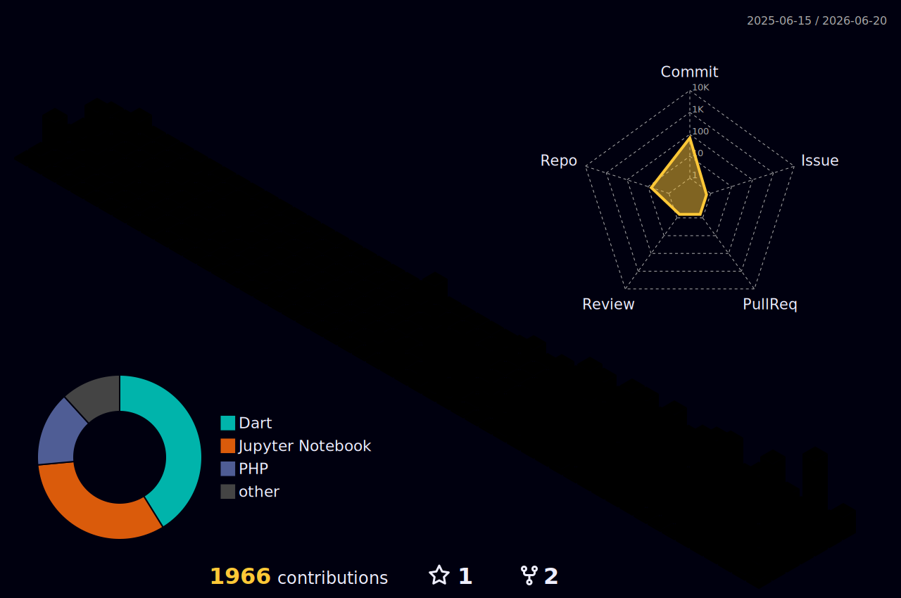

<div align="center">

# Defangga Aby Vonega

**Full-Stack Developer | Mobile Developer | Project Manager | Business Analyst**

[](https://git.io/typing-svg)

</div>

---

## About

```php
<?php

class Defangga {
    public string $name     = "Defangga Aby Vonega";
    public string $role     = "Full-Stack Developer | Mobile Developer | Project Manager | Business Analyst";
    public string $company  = "One Circle Software Development";
    public string $location = "Central Lampung, Indonesia";
    public array  $stack    = ["Laravel", "Filament", "Flutter", "MySQL", "Dart"];
    public array  $current  = [
        "Enterprise Finance System",
        "Aircraft Parts Management",
        "Tournament & Bracket Platform",
    ];
}
```

- Founder and developer at One Circle Software Development
- Built 50+ projects across web, mobile, and data science
- Builds enterprise systems for aviation, finance, and healthcare industries
- Based in Central Lampung, Indonesia

---

## Currently Learning


---

## Tech Stack

<div align="center">

**Backend**


**Mobile**


**Frontend**


**Tools**


</div>

---

## GitHub Stats

<div align="center">


</div>

<div align="center">

[](https://git.io/streak-stats)

</div>

---

## Trophy

<div align="center">

[](https://github.com/ryo-ma/github-profile-trophy)

</div>

---

## Activity Graph

<div align="center">

[](https://github.com/ashutosh00710/github-readme-activity-graph)

</div>

---

## Contribution Graph

<div align="center">

<picture>
  <source media="(prefers-color-scheme: dark)" srcset="https://raw.githubusercontent.com/defanggaabypn/defanggaabypn/output/github-contribution-grid-pacman-dark.svg">
  <source media="(prefers-color-scheme: light)" srcset="https://raw.githubusercontent.com/defanggaabypn/defanggaabypn/output/github-contribution-grid-pacman.svg">
  
</picture>

</div>

---

## 3D Contribution

<div align="center">



</div>

---

## Open Source Projects

<div align="center">

[](https://github.com/defanggaabypn/church_scheduling)
[](https://github.com/defanggaabypn/omron)
[](https://github.com/defanggaabypn/rekammedis)
[](https://github.com/defanggaabypn/klasifikasi-judul-skripsi)
[](https://github.com/defanggaabypn/optimasi-train)

</div>

---

## Connect

<div align="center">

[](https://www.linkedin.com/in/defangga-aby-vonega)
[](https://github.com/defanggaabypn)


</div>
